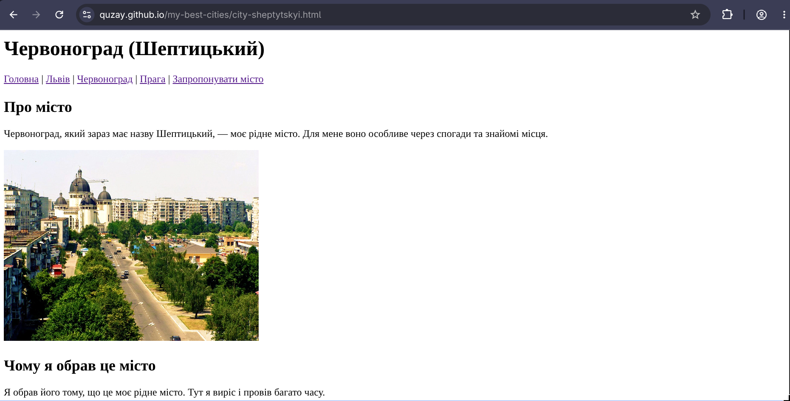

# Звіт до лабораторної роботи №1

## Тема

Імплементація блогу «Мої 3 найкращі міста світу». Розміщення проєкту в репозиторії GitHub.

## Мета роботи

Навчитися створювати багатосторінковий статичний вебсайт з використанням HTML, Git, GitHub та GitHub Pages.

## Виконання роботи

- створено багатосторінковий HTML-сайт;
- використано семантичні HTML-теги;
- реалізовано навігацію між сторінками;
- додано інформацію про три міста та HTML-форму;
- проєкт розміщено на GitHub;
- сайт опубліковано за допомогою GitHub Pages.

## Результат

Посилання на опубліковану сторінку:

https://quzay.github.io/Web/lab_1(cities)/

Скріншот результату:

## Висновок

Під час виконання лабораторної роботи було закріплено навички створення HTML-сторінок, роботи з Git та GitHub, а також публікації статичного сайту за допомогою GitHub Pages.
