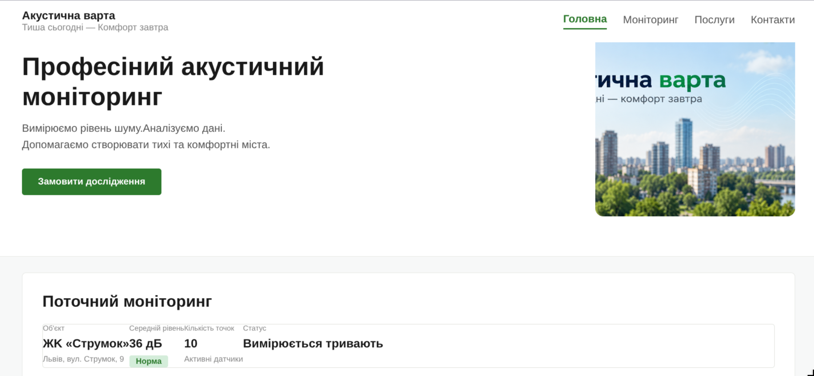

# Звіт до лабораторної роботи №2

## Тема

Верстка сайту компанії «Акустична варта» згідно з інструкцією (HTML/CSS).

## Мета роботи

Практично застосувати CSS для оформлення семантичної HTML-структури вебсторінки, навчитися використовувати селектори, каскад, specificity, Box Model та властивість display.

## Виконання роботи

- створено односторінковий сайт компанії «Акустична варта»;
- використано семантичні HTML-елементи `header`, `nav`, `main`, `section`, `article`, `aside` та `footer`;
- створено та підключено зовнішній CSS-файл;
- використано селектори елементів, класів, `id`, атрибутів та універсальний селектор;
- реалізовано стилізацію тексту, фону, блоків та карток;
- застосовано властивості `width`, `height`, `margin`, `padding`, `border` та `box-sizing`;
- використано `display: block`, `inline` та `inline-block`;
- додано ефекти `hover` і `transition`;
- використано `position` та `transform` для окремих елементів;
- реалізовано форму замовлення дослідження;
- перевірено відображення сторінки у браузері та за допомогою DevTools.

## Результат

Посилання на опубліковану сторінку:

https://quzay.github.io/Web/lab_2(acustic)/index.html

Скріншот результату:

## Висновок

Під час виконання лабораторної роботи було закріплено навички створення та стилізації вебсторінки за допомогою HTML і CSS. Було опрацьовано селектори, каскад, specificity, Box Model, display та інші основні можливості CSS.
